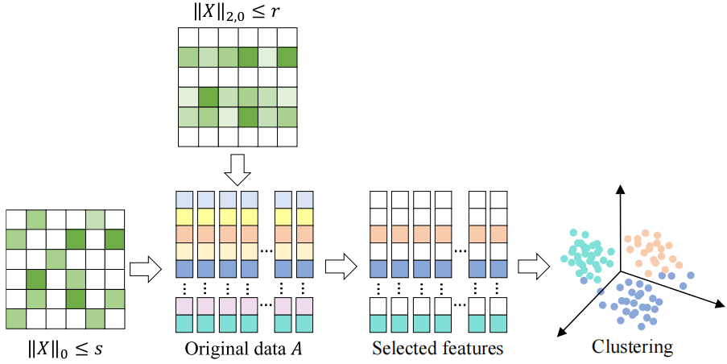

# DSCOFS

The code in this toolbox implements "Enhancing Unsupervised Feature Selection via Double Sparsity Constrained Optimization" by <i>X. Li, H. Chen, A. Yang, X. Xiu</i>.

### Testing

This project is implemented in MATLAB.
* Place the testing datasets in the data folder.
* Directly run demo.m to reproduce experimental results.

### Requirement
STOP is a toolbox for solving optimization problems with orthogonality constraints, which can be downloaded from https://lsec.cc.ac.cn/~liuxin/code.html.

### Dataset
*  https://github.com/milaan9/Clustering-Datasets/
*  https://jundongl.github.io/scikit-feature/datasets.html
  
### Citation
Please give credits to this paper if this code is useful and helpful for your research.

